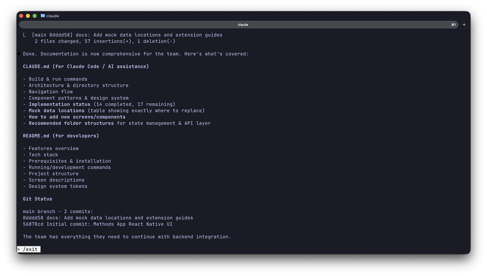
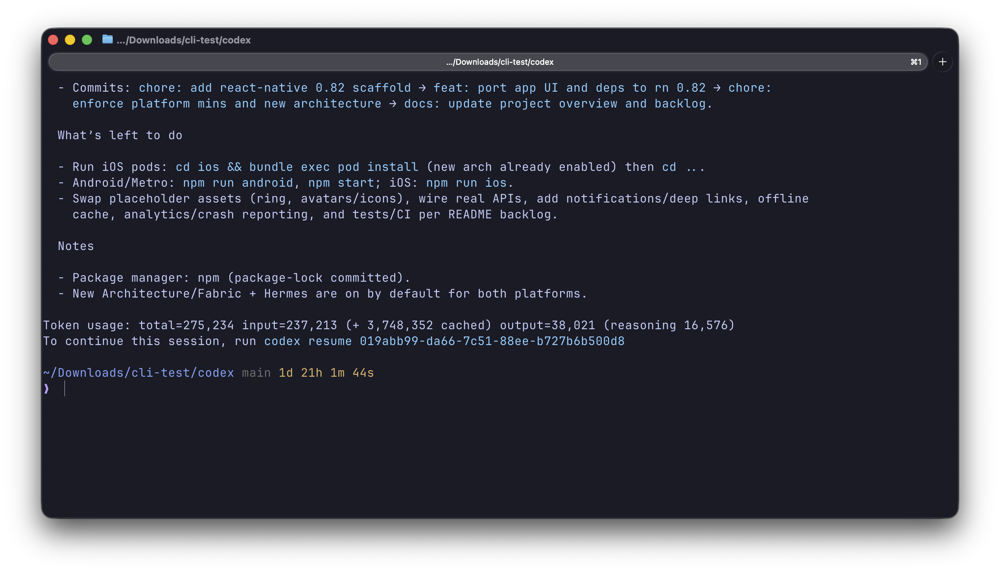
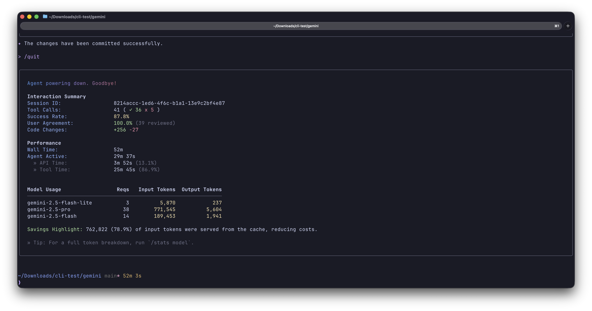

# Battle 001: React Native UI from Screenshot

**Challenge:** Build a React Native mobile app UI from a single screenshot.

## Input

Each CLI was given the same UI screenshot ([view](input/ui.jpeg)) showing 6 screens of a "Methods" app (Credit: [Jay Dwivedi](https://x.com/jaydwivedi/status/1993306940823503037?s=20)):

- Splash screen with ring logo
- Phone number input
- Notification permission prompt
- Account settings
- Group chat
- Earnings/stats view

### The Prompt

> Review the image and build the app as you see fit.

## Results

| CLI | Framework | Video |
|-----|-----------|-------|
| [Claude Code](claude/) | React Native + Expo | Coming Soon |
| [Codex CLI](codex/) | React Native CLI | Coming Soon |
| [Gemini CLI](gemini/) | Expo | Coming Soon |

## Screenshots

| Claude | Codex | Gemini |
|--------|-------|--------|
|  |  |  |

## Observations

> Coming soon - detailed comparison notes will be added after video review.

## Folder Structure

```text
001-react-native-ui/
├── input/          # The UI screenshot given to all CLIs
├── artifacts/      # Screenshots of each CLI's output
├── claude/         # Claude Code's implementation
├── codex/          # Codex CLI's implementation
└── gemini/         # Gemini CLI's implementation

```

---

[Back to all battles](../../README.md)
